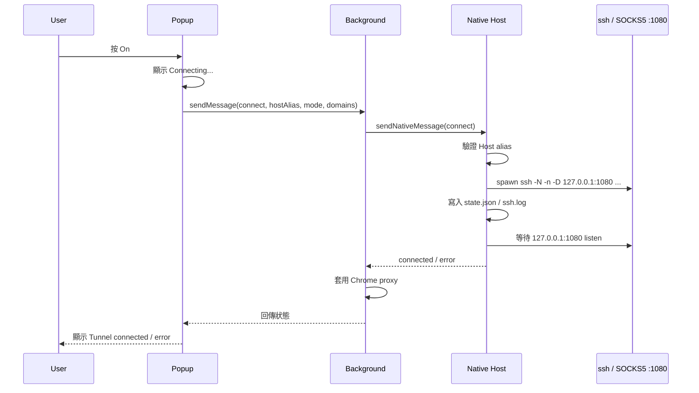
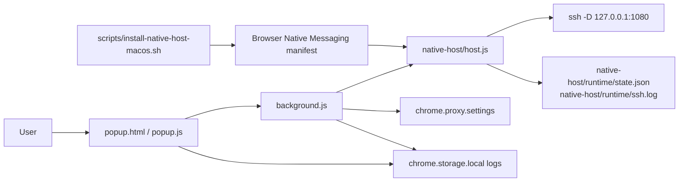

# Webhole

Minimal Manifest V3 Chrome extension for controlling a local SSH SOCKS5 tunnel through a Native Messaging Host.

## Flow





## File Roles

- `popup.html`: UI 版面、說明、Log、操作按鈕。
- `popup.js`: 讀寫 storage、送 connect/disconnect/status、更新畫面與 log。
- `background.js`: 接 popup 訊息、呼叫 native host、套用或清除 Chrome proxy。
- `native-host/host.js`: 執行 `ssh`，管理 PID，檢查 `1080`，回傳 native messaging response。
- `scripts/install-native-host-macos.sh`: 安裝 browser native host manifest，建立 wrapper，支援 `chrome`、`chrome-dev`、`edge`、`edge-dev`。
- `.gitignore`: 排除 runtime 與本機產物。

## Install

```sh
sh scripts/install-native-host-macos.sh chrome-dev
```

Then load the unpacked extension from:

```text
<project-root>
```
