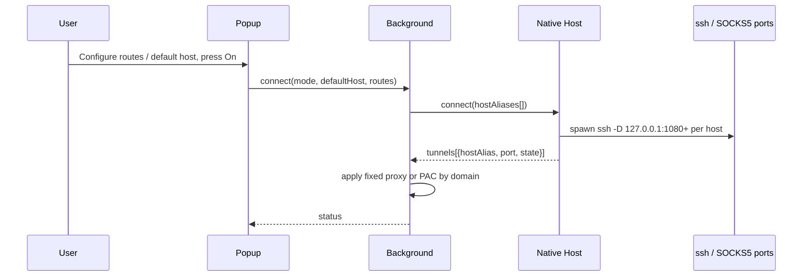

# Webhole

Minimal Manifest V3 Chrome extension (v0.2.7) for controlling local SSH SOCKS5 tunnels through a Native Messaging Host.

Supports **multiple simultaneous tunnels**: different hostname or `hostname/path` prefixes can use different SSH Host aliases via Routes mode.

## Modes

| Mode | Behavior |
|------|----------|
| **Direct** | Clear browser proxy |
| **Global** | All traffic through Default SSH Host tunnel (Default required) |
| **Routes** | Enabled rules map to SSH Hosts; Default optional. Unmatched traffic is **DIRECT** by default, or Default Host if fallback is enabled |

## Flow



## File Roles

- `popup.html` / `popup.js`: UI, route table, default host select, On/Off.
- `background.js`: native messaging, multi-port PAC / global proxy, settings migration.
- `native-host/host.js`: parse `~/.ssh/config`, manage multiple ssh tunnels and ports.
- `scripts/install-native-host-macos.sh`: install browser native host manifest.

## Install

```sh
sh scripts/install-native-host-macos.sh chrome-dev
```

Then load the unpacked extension from the project root.

## Routes example

| Pattern | SSH Host | Matches |
|---------|----------|---------|
| `corp.example.com/api` | `jump-corp` | `https://corp.example.com/api/...` |
| `corp.example.com/wiki` | `jump-int` | `https://corp.example.com/wiki/...` |
| `corp.example.com` | `jump-corp` | other paths on that host |
| `github.com` | `jump-corp` | host only (any path) |

Same SSH Host shares one local SOCKS port. Longer **path** prefixes win first, then longer hostnames.

## Notes

- **SSH Host = SOCKS egress host** (where traffic exits), not the website you want to open.
- **Global** requires Default SSH Host. **Routes** does **not** require Default; only enabled route hosts start. Unmatched traffic is DIRECT unless fallback is set to Default Host.
- While already connected (session desired), changing Mode / Default Host / Routes / route enable flags automatically reconciles tunnels (no second On).
- Each route has an enable checkbox; **All on** / **All off** toggles every route. Only enabled routes open tunnels and match PAC.
- Route pattern may be `host` or `host/path` (path prefix). Example: `example.com/api`.
- SOCKS ports start at `127.0.0.1:1080` and increment per distinct SSH Host.
- Max 8 tunnels and 50 routes.
- Legacy `auto` + `domains` settings migrate to Routes on load.
- Tunnel SSH forces `ControlMaster=no` / `ControlPath=none` so mux sessions do not break PID tracking.
- Tunnel ready wait is up to 30s (ProxyCommand / jump hosts); stderr is appended to `native-host/runtime/ssh.log`.
- Install native host with `sh scripts/install-native-host-macos.sh chrome` (uses `run-host.sh` + absolute node path).
