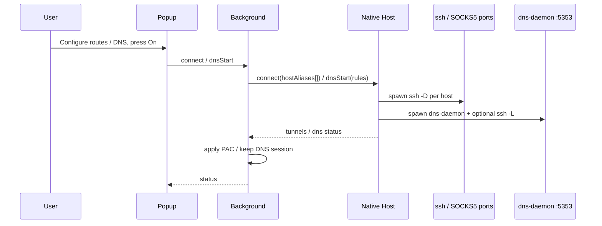

# Webhole

Minimal Manifest V3 Chrome extension (v0.3.0) for controlling local SSH SOCKS5 tunnels through a Native Messaging Host, plus **Split DNS** (domain suffix → different nameservers, optionally via SSH).

Supports **multiple simultaneous tunnels**: different hostname or `hostname/path` prefixes can use different SSH Host aliases via Routes mode.

## Modes (proxy)

| Mode | Behavior |
|------|----------|
| **Direct** | Clear browser proxy |
| **Global** | All traffic through Default SSH Host tunnel (Default required) |
| **Routes** | Enabled rules map to SSH Hosts; Default optional. Unmatched traffic is **DIRECT** by default, or Default Host if fallback is enabled |

## Split DNS (independent)

| Feature | Behavior |
|---------|----------|
| **DNS On/Off** | Independent of proxy mode |
| **Rules** | Domain suffix → **Direct** nameserver (IP:port) or **Via SSH** (`ssh -L` to remote DNS) |
| **Default** | Unmatched names → Default NS (default `1.1.1.1:53`) |
| **Stub** | `127.0.0.1:53535` (configurable; avoids mDNS 5353); loopback only |
| **macOS resolver** | Optional `/etc/resolver/<domain>` stubs → stub port |

**Names vs paths:** Split DNS answers *how a name resolves*. Routes answer *where TCP traffic exits*. Chrome traffic that already goes through SOCKS5 may still resolve on the remote side; Split DNS helps DIRECT browser traffic, CLI tools, and apps that use system/resolver configuration.

## Flow



## Architecture & DNS flow (SVG)


Also see the original SOCKS-focused flowchart: [output/webhole-flow.svg](output/webhole-flow.svg).

## File Roles

- `popup.html` / `popup.js`: UI, route table, Split DNS panel, On/Off, dig-like test.
- `background.js`: native messaging, multi-port PAC / global proxy, DNS reconcile, settings migration.
- `native-host/host.js`: parse `~/.ssh/config`, manage SOCKS tunnels, DNS daemon, DNS SSH forwards, macOS resolver stubs.
- `native-host/dns-daemon.js`: long-running local UDP DNS stub (suffix rules + default upstream).
- `scripts/install-native-host-macos.sh`: install browser native host manifest.

## Install

```sh
sh scripts/install-native-host-macos.sh chrome-dev
```

Then load the unpacked extension from the project root (Chrome → Extensions → Developer mode → Load unpacked).

## Routes example

| Pattern | SSH Host | Matches |
|---------|----------|---------|
| `corp.example.com/api` | `jump-corp` | `https://corp.example.com/api/...` |
| `corp.example.com/wiki` | `jump-int` | `https://corp.example.com/wiki/...` |
| `corp.example.com` | `jump-corp` | other paths on that host |
| `github.com` | `jump-corp` | host only (any path) |

Same SSH Host shares one local SOCKS port. Longer **path** prefixes win first, then longer hostnames.

## Split DNS example

| Domain | Kind | Nameserver | SSH Host |
|--------|------|------------|----------|
| `corp.example.com` | Via SSH | `10.0.0.53:53` | `jump-corp` |
| `internal` | Direct | `192.168.1.1:53` | — |
| *(default)* | Direct | `1.1.1.1:53` | — |

Manual check after **DNS On**:

```sh
dig @127.0.0.1 -p 53535 app.corp.example.com
```

Optional macOS system integration (admin prompt):

1. Enable rules for the zones you care about.
2. Click **Install resolver** (writes `/etc/resolver/<domain>` with `nameserver 127.0.0.1` + `port 53535`).
3. Verify with `scutil --dns`. Use **Uninstall resolver** to remove Webhole-managed stubs.

## Notes

- **SSH Host = SOCKS egress host** (where traffic exits), not the website you want to open.
- **Global** requires Default SSH Host. **Routes** does **not** require Default; only enabled route hosts start. Unmatched traffic is DIRECT unless fallback is set to Default Host.
- While already connected (session desired), changing Mode / Default Host / Routes / route enable flags automatically reconciles tunnels (no second On).
- Each route has an enable checkbox; **All on** / **All off** toggles every route. Only enabled routes open tunnels and match PAC.
- Route pattern may be `host` or `host/path` (path prefix). Example: `example.com/api`.
- SOCKS ports start at `127.0.0.1:1080` and increment per distinct SSH Host.
- DNS forward ports start at `127.0.0.1:15353` (via_ssh only).
- Max 8 tunnels, 50 routes, 50 DNS rules, 16 DNS SSH forwards.
- DNS session is **independent** of proxy Off; use **DNS Off** separately.
- Nameserver fields must be **IPv4 literals** (avoids resolver loops).
- Legacy `auto` + `domains` settings migrate to Routes on load.
- Tunnel SSH forces `ControlMaster=no` / `ControlPath=none` so mux sessions do not break PID tracking.
- Tunnel ready wait is up to 30s (ProxyCommand / jump hosts); stderr is appended to `native-host/runtime/ssh.log`.
- DNS logs: `native-host/runtime/dns.log`.
- Install native host with `sh scripts/install-native-host-macos.sh chrome` (uses `run-host.sh` + absolute node path).
