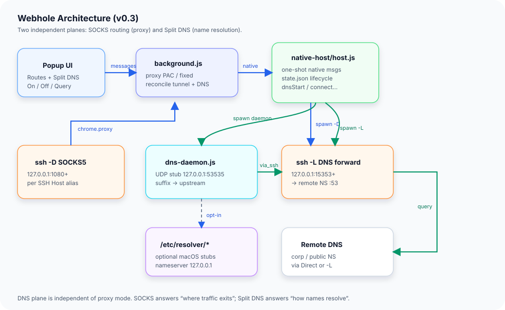
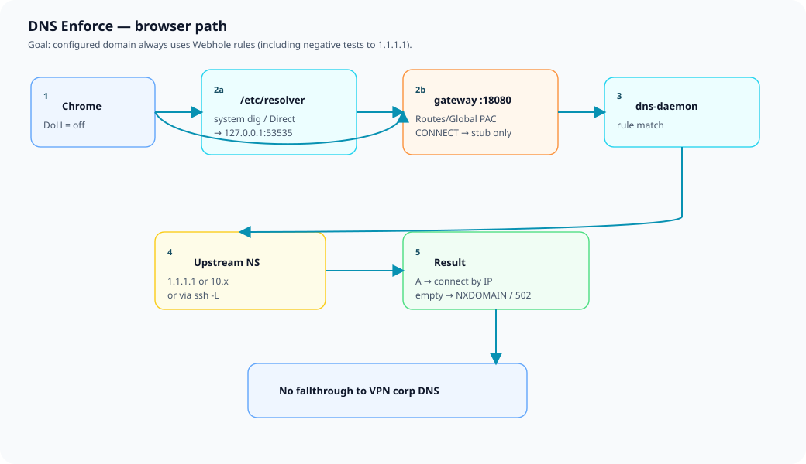

# Webhole

Manifest V3 Chrome extension (**v0.4.0**) for:

1. **SSH SOCKS5 tunnels** (Global / Routes)  
2. **DNS Enforce** — domain → nameserver，且 **瀏覽器必須走你設定的 DNS**（方案 D）

## 為什麼需要 DNS Enforce？

只開 local stub **不會**自動讓 Chrome 用它。系統 VPN DNS、Chrome 安全 DNS (DoH)、SOCKS **遠端解析** 都會繞過規則。

v0.4 **三閘**（DNS On 且 Enforce 預設開）：

| 閘 | 行為 |
|----|------|
| **OS** | 自動寫 `/etc/resolver/<domain>` → `127.0.0.1:53535`，並 flush cache |
| **Chrome DoH** | 嘗試 `secureDNSMode=off`（需 `privacy` 權限） |
| **Proxy** | **含 Direct**：命中 DNS 規則的 host 走本機 **HTTP CONNECT gateway**（只問 stub；無答案 → 502）。有 tunnel 時再經 SOCKS |

## Modes (proxy)

| Mode | Behavior |
|------|----------|
| **Direct** | 一般流量不走 tunnel；**DNS Enforce 規則域仍走 gateway**（強制 stub 解析） |
| **Global** | 全部流量經 Default SSH Host（Enforce 時經 gateway） |
| **Routes** | 規則命中走對應 SSH Host；DNS 規則域優先走 gateway |

## Split DNS

| 項目 | 預設 |
|------|------|
| Stub | `127.0.0.1:53535` |
| Enforce | **On** |
| 規則 | suffix → Direct IP 或 Via SSH (`ssh -L`) |
| Default NS | 未命中規則（例 `1.1.1.1`） |
| 命中規則且上游無答案 | **NXDOMAIN** + gateway **502**（Chrome 開不了） |

### 驗收範例（內網名負向 → 1.1.1.1）

1. Mode **Direct**，規則：`opscenter.cit.insea.io` → Direct `1.1.1.1`，**DNS On**  
2. 狀態列應有 `gw:18080`（不只 stub）  
3. 檢查：
   ```sh
   dig @127.0.0.1 -p 53535 opscenter.cit.insea.io   # NXDOMAIN
   python3 -c "import socket; print(socket.getaddrinfo('opscenter.cit.insea.io',443))"
   # 應失敗
   # 注意：dig / host（不加 @）在 macOS 可能仍顯示 10.x，不要當標準
   ```
4. 狀態列須有 **`gw:18080`**（沒有 gw = PAC 未掛，Chrome 會繞過）  
5. Chrome **無痕視窗**開 `https://opscenter.cit.insea.io` → **應失敗**  
6. **取消規則再重新勾選／再套用 1.1.1.1** → 仍應失敗（且 `gateway.log` 有新的 `listening` / `RESOLVE_FAIL`）  
7. 改 nameserver 為 `10.24.11.11` 後 → 應可開  

若 Chrome 仍開得了：確認 `gw:` 有顯示；關掉 Secure DNS（`chrome://settings/security`）；用無痕或清該站資料。

## Architecture (SVG)





## Install

```sh
sh scripts/install-native-host-macos.sh chrome-dev
```

Chrome → 載入未封裝 extension（專案根目錄）。  
DNS On / Reinstall resolver 會跳出 **系統管理員授權**（寫 `/etc/resolver`）。

### 密碼 / Touch ID

Chrome 的 native host **無法可靠地**在系統「管理員密碼」框裡強制出現 Touch ID（這是 macOS 限制）。

**日常建議（瀏覽器 Enforce）：**

- 保持 **「系統 /etc/resolver」關閉**（預設）→ DNS On **不必輸入密碼**（只走 gateway）
- 只有 CLI / 其它 App 也要 split DNS 時，才勾「系統 /etc/resolver」

**若要系統 resolver + Touch ID：**

```sh
# 一次設定：讓 sudo 可用指紋
sh scripts/enable-touchid-sudo-macos.sh
sudo -v   # 應跳出 Touch ID
```

然後在 Webhole 勾「系統 /etc/resolver」，按 **Reinstall resolver** → 會開 **Terminal** 用 `sudo`（指紋），而不是 Chrome 的密碼框。

## File roles

- `popup.html` / `popup.js` — UI（Routes + DNS Enforce）  
- `background.js` — PAC / gateway / DoH / native messaging  
- `native-host/host.js` — tunnels、dns-daemon、resolver、gateway 生命週期  
- `native-host/dns-daemon.js` — stub  
- `native-host/proxy-gateway.js` — resolve-then-proxy CONNECT  

## Notes

- Nameserver 必須是 **IPv4**。  
- DNS Off 會卸 resolver、停 gateway，並嘗試還原 Secure DNS。  
- Popup Enforce 狀態列：`stub` / `resolver` / `DoH` / `gw`。  
- 日誌：`native-host/runtime/dns.log`、`gateway.log`、`ssh.log`。  
- Max：8 tunnels、50 routes、50 DNS rules。  
